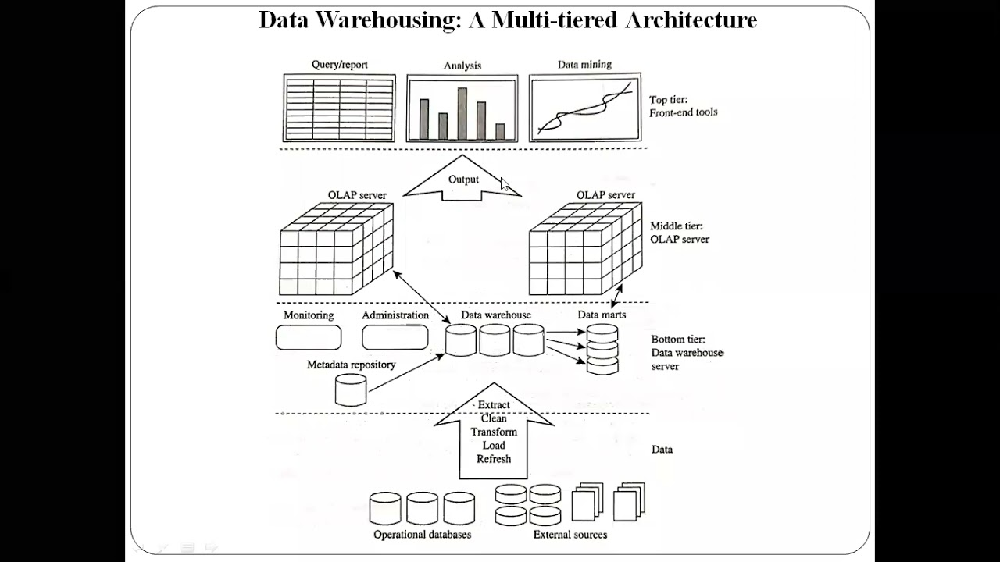
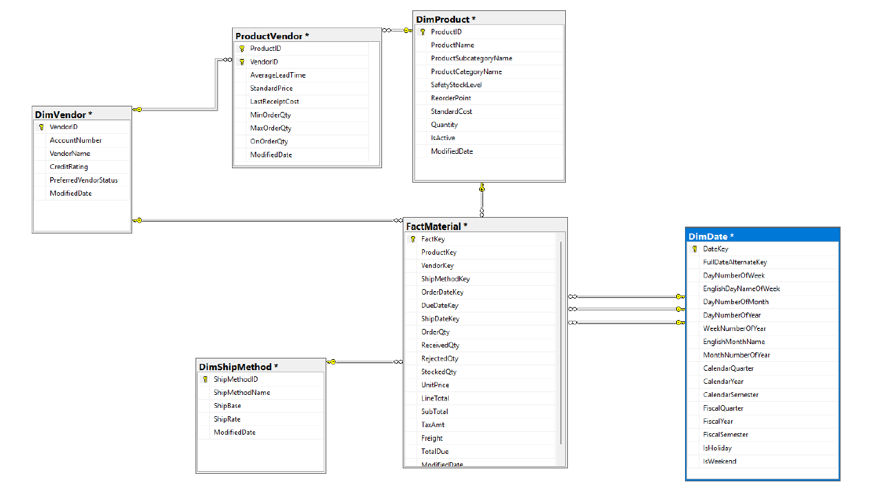
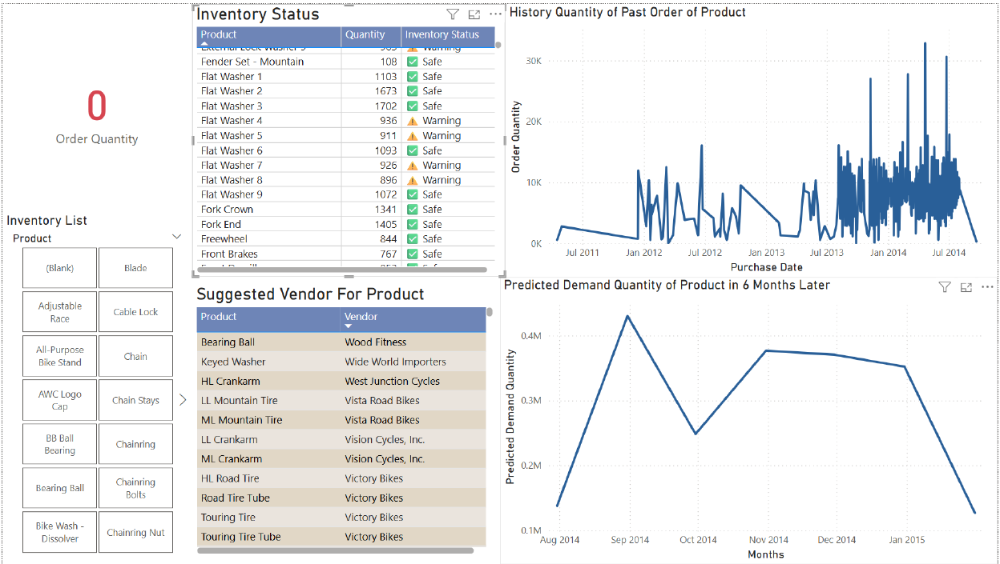

# Material Purchase & Planning BI System

> An end-to-end Business Intelligence solution for procurement and inventory planning,
> built on SQL Server Data Warehouse, SSIS ETL, Python ML models, and Power BI.


## Overview

| Layer | Technology |
|---|---|
| Data Source | AdventureWorks OLTP (SQL Server) |
| Data Warehouse | Star Schema — SQL Server |
| ETL | SSIS (incremental + near real-time) |
| Machine Learning | Prophet · Random Forest (Python) |
| BI Dashboard | Power BI Desktop (DirectQuery) |


## Architecture



The pipeline flows: **ERP/OLTP → ETL (SSIS) → Data Warehouse → ML models → Power BI**.


## Data Warehouse Design



- **Fact:** `FactMaterial` — purchasing transactions (OrderQty, ReceivedQty, Cost, TotalDue)
- **Dimensions:** `DimProduct` · `DimVendor` · `DimDate` · `DimShipMethod`
- **Bridge:** `ProductVendor` — vendor terms (price, lead time, min/max order qty)


## Power BI Dashboard



| View | Key indicators |
|---|---|
| Inventory | Safe / Warning / Emergency status per product |
| Demand | 6-month forecast vs. historical orders |
| Vendor | Recommended suppliers ranked by cost · lead time · rating |


## Machine Learning

### Demand Forecasting — Prophet
- Monthly demand forecast per product (6-month horizon)
- Log-transform pipeline; negative predictions clipped to zero
- Outputs: `ForecastMonth`, `PredictedDemandQty`, `LowerBound`, `UpperBound`

### Vendor Scoring — Random Forest Regression
- Composite vendor score from: `AverageCost`, `AverageLeadTime`, `CreditRating`, `PreferredVendorStatus`, `ActiveFlag`
- Inactive vendors excluded automatically


## Quick Start

```bash
pip install pandas scikit-learn prophet matplotlib
```

Run notebooks in order:

1. `System Resources/ML/Vendor Selection/Random_Forest_Regression.ipynb`
2. `System Resources/ML/Monthly Demand Forecast/Time_Series_Forecasting_(Prophet).ipynb`

Open Power BI:

- File: `System Resources/BI Visualization/MPP_BI Dashboard.pbix`
- Update SQL Server connection string if needed


## Repository Structure

```text
Team10/
├── images/                          # Architecture, schema, dashboard screenshots
├── Report/                          # Technical report (PDF)
└── System Resources/
    ├── BI Visualization/            # Power BI file (.pbix)
    ├── Data Warehouse Design/       # DW design artifacts
    ├── ETL pineline/                # SSIS packages & config
    └── ML/
        ├── Vendor Selection/        # Random Forest notebook + CSV
        └── Monthly Demand Forecast/ # Prophet notebook + CSV
```


## Contributors

| Name | Student ID |
|---|---|
| Pham Duc Manh | 10422047 |
| Nguyen Thao Vy | 10421067 |
| Luong Tieu Cuong | 104220889 |
| Nguyen Thien Nguyen | 10422059 |
| Nguyen Hoang Yen Ngoc | 10422056 |
